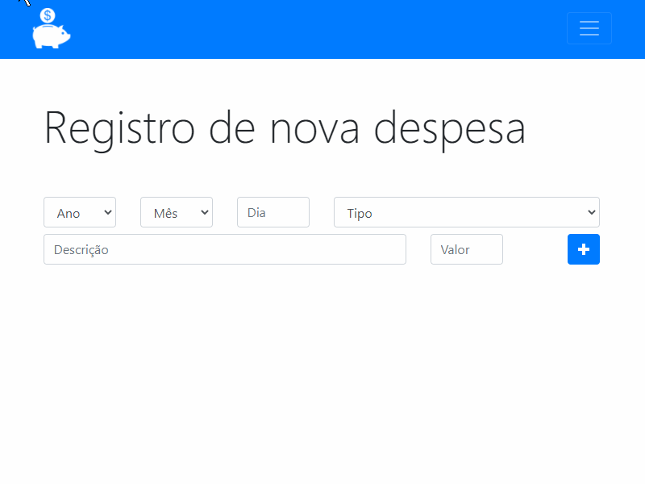
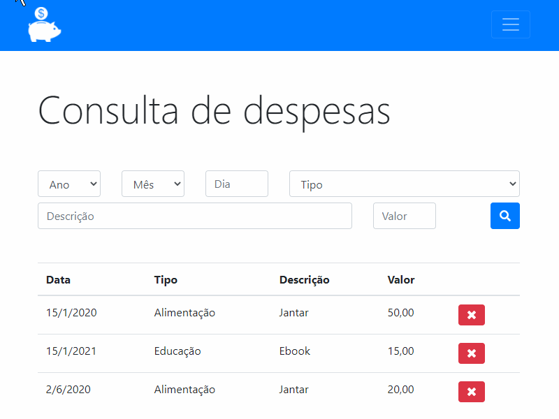
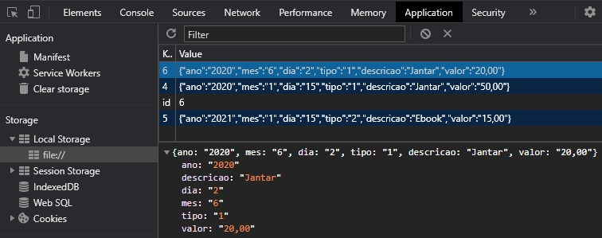

# App Controle de despesas
Site para controle de despesas feito em Javascript puro usando LocalStorage do navegador como BD

## O que esse programa faz?

### Cadastro de despesas

### Consulta, filtro e exclusão de despesas

### Local Storage
As despesas ficam salvas no local storage do navegador em formato JSON

## Links úteis
* [Documentação Javascript](https://developer.mozilla.org/pt-BR/docs/Web/JavaScript)
* [Documentação Bootstrap](https://getbootstrap.com.br/docs/4.1/getting-started/introduction/)
* [Local Storage](https://developer.mozilla.org/pt-BR/docs/Web/API/Window/Window.localStorage)
* [JSON](https://developer.mozilla.org/pt-BR/docs/Web/JavaScript/Reference/Global_Objects/JSON)
